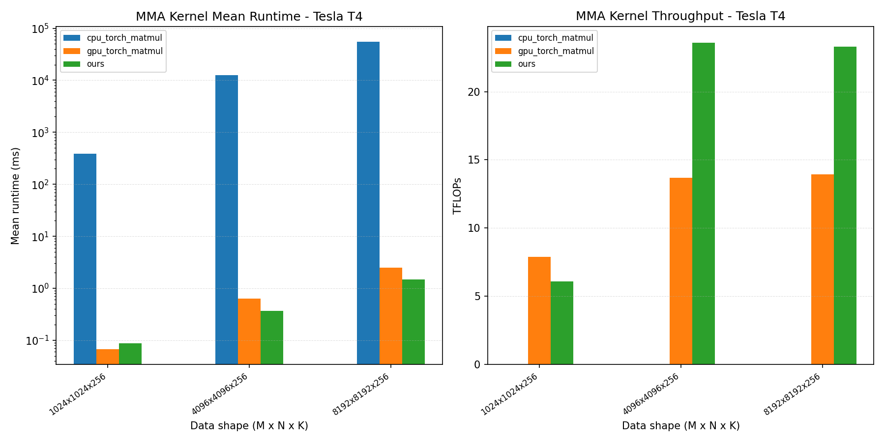
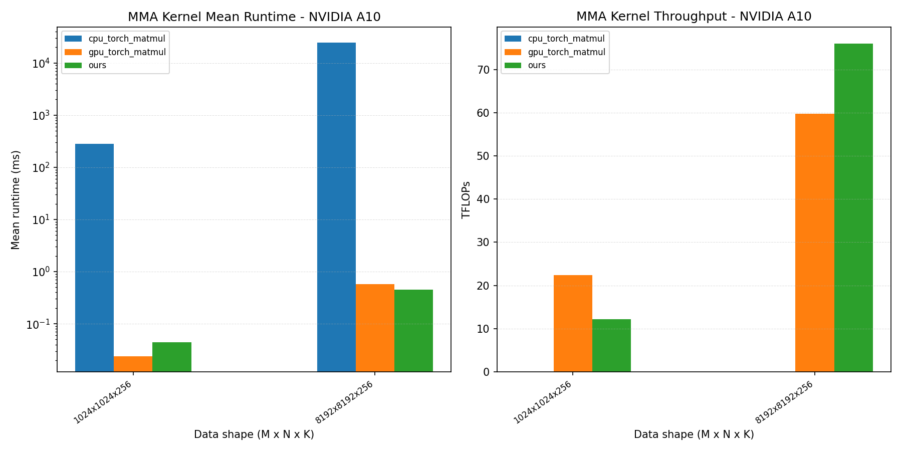
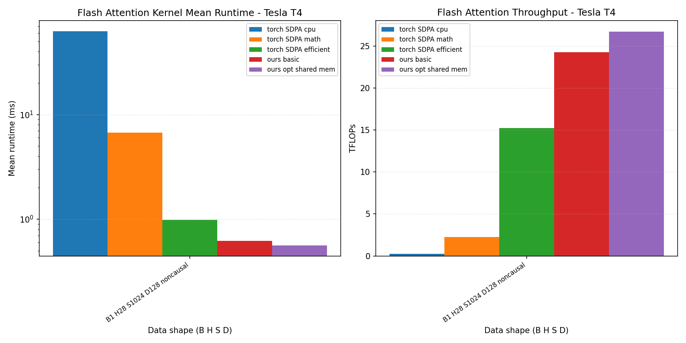
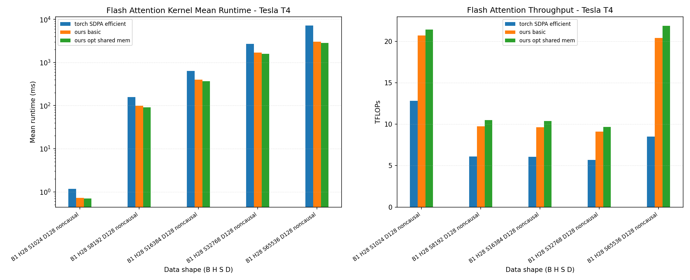
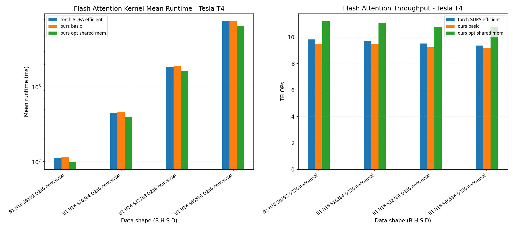
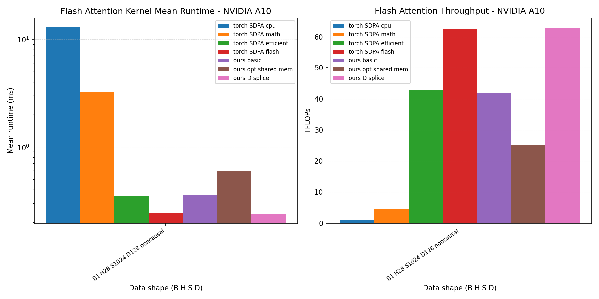
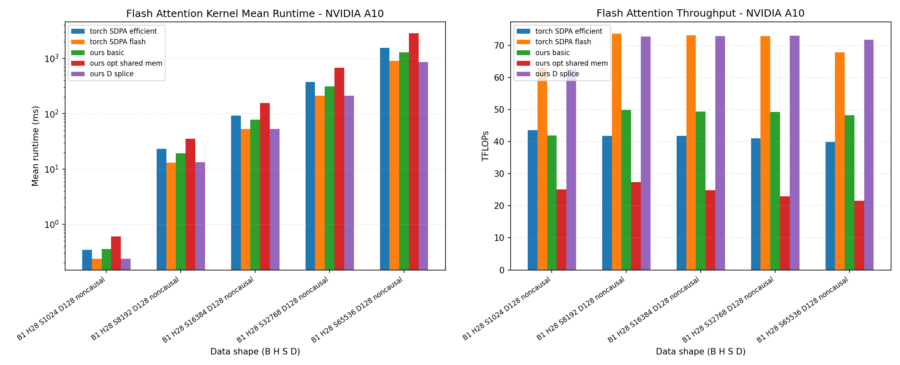
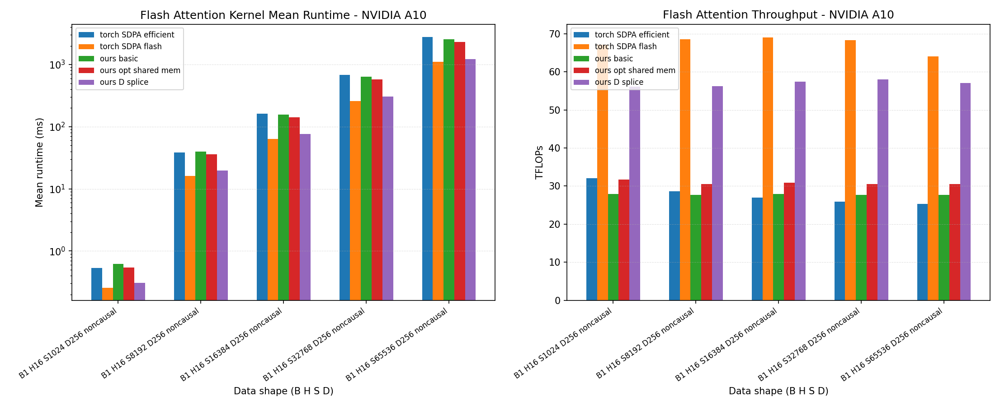
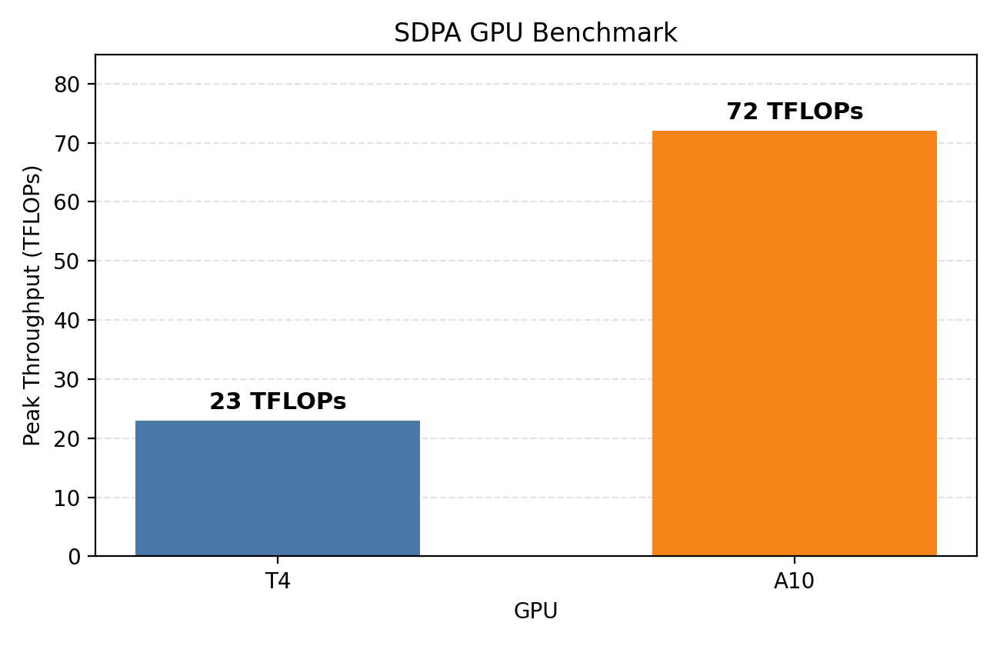
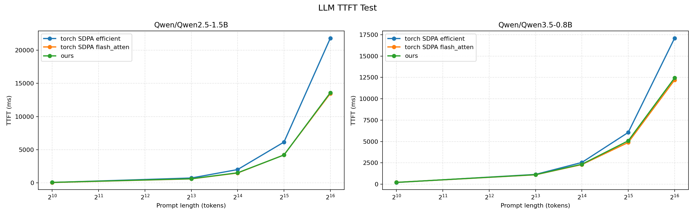

# flash-attn-economical-gpu
A set of implementations on Triton based FlashAttention are proposed, which beats or reaches comparable performance with popular library such as Pytorch's FlashAttention SDPA, across multiple economical GPU architectures such as Turing and Ampere.

## Results

Our Triton MMA matrix multiplication kernel outperforms `torch.matmul` on Turing across the tested data lengths, reaching up to 80% higher performance.

The Triton MMA matrix multiplication kernel also improves over `torch.matmul` on Ampere, with gains up to 25% in the measured configurations.

For `D=128` on Turing, the basic Triton FlashAttention kernel substantially exceeds PyTorch math and efficient SDPA backends, while the optimized kernel adds about 8% more throughput.

Across different sequence lengths with `D=128` on Turing, the optimized Triton SDPA kernel remains the fastest tested backend.

For `D=256` on Turing, the optimized Triton SDPA kernel continues to lead the tested PyTorch SDPA alternatives.

On Ampere, the sliced Triton SDPA kernel reaches performance comparable to PyTorch FlashAttention, which is backed by cuDNN.

For `D=128` on Ampere, the sliced Triton SDPA kernel stays close to PyTorch FlashAttention as problem size increases.

For `D=256` on Ampere, the sliced Triton SDPA kernel reaches nearly 60 TFLOPs and is at most about 16% slower than PyTorch FlashAttention.

The SDPA peak-throughput benchmark shows the A10 delivering at least 3x the throughput of the T4.

In LLM TTFT tests on Qwen2.5 and Qwen3.5, the sliced Triton kernel remains close to PyTorch FlashAttention and clearly faster than PyTorch efficient SDPA.
